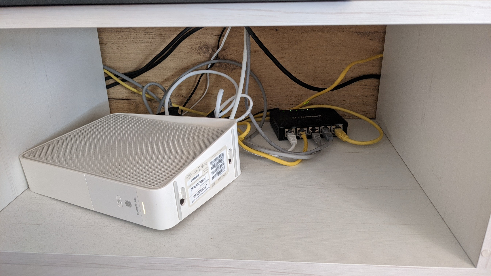
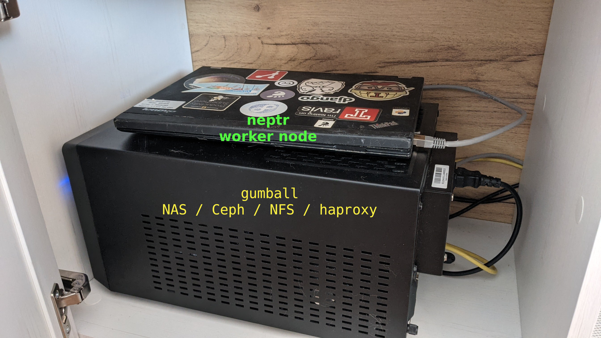
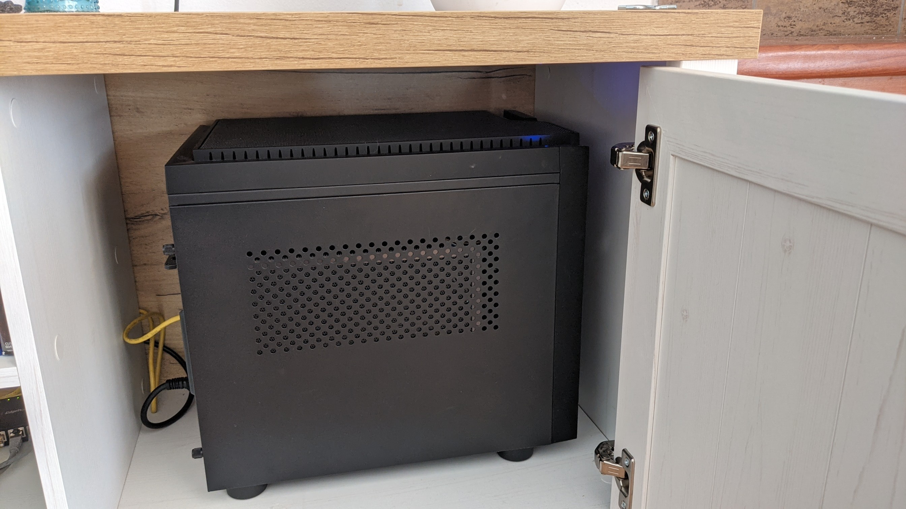

# Vadim's homelab

<!--- cSpell:ignore Vadim's homelab loadbalancer ceph NVME dnsmasq helpernode autoprovision ostree grafana datasource datasources promtail gitops gitea minio nextcloud navidrome pleroma microblogging wallabag neptr -->

This describes the resources used by OpenShift after performing an installation
to make it similar to my homelab setup.

## Compute

1. Ubiquity EdgeRouter ER-X
    - runs DHCP (embedded), custom DNS server via AdGuard

    {width=80%}

1. NAS/Bastion host
    - haproxy for loadbalancer
    - ceph cluster for PVs
    - NFS server for shared data

    {width=80%}

1. control plane
    - Intel i5 CPU, 16+4 GB RAM
    - 120 GB NVME disk

    {width=80%}

1. compute nodes
    - Lenovo X220 laptop

    {width=80%}

## Router setup

Once nodes have booted assign static IPs using MAC pinning.

EdgeRouter has dnsmasq to support custom DNS entries, but I wanted to have a network-wide ad filtering
and DNS-over-TLS for free, so I followed [this guide](https://medium.com/@casonadams/edgerouter-x-adguardhome-b9d453f5725b){: target=_blank} to install [AdGuard Home](https://adguard.com/en/adguard-home/overview.html){: target=_blank} on the router.

This gives a fancy UI for DNS rewrites and gives a useful stats about the nodes on the network.

## NAS/Bastion setup

HAProxy setup is fairly standard - see [ocp4-helpernode](https://github.com/RedHatOfficial/ocp4-helpernode){: target=_blank} for idea.

Along with (fairly standard) NFS server I also run a single node Ceph cluster, so that I could benefit from CSI / autoprovision / snapshots etc.

## Installation

Currently "single node install" requires a dedicated throwaway bootstrap node, so I used future compute node (x220 laptop) as a bootstrap node. Once master was installed, the laptop was re-provisioned to become a compute node.

## Upgrading

Since I use a single master install, upgrades are bit complicated. Both nodes are labelled as workers, so upgrading those is not an issue.

Upgrading single master is tricky, so I use [this script](https://github.com/vrutkovs/okd-installer/blob/master/manifests/singlenode/upgrade-master.sh){: target=_blank} to pivot the node into expected master ignition content, which runs `rpm-ostree rebase <new content>`. This script needs to be cancelled before it starts installing OS extensions (NetworkManager-ovs etc.) as its necessary.

This issue as a class would be addressed in 4.8.

## Useful software

[Grafana operator](https://operatorhub.io/operator/grafana-operator){: target=_blank} is incredibly useful to setup monitoring.

This operator helps me to define a configuration for various datasources (i.e. [Promtail+Loki](https://grafana.com/oss/loki/){: target=_blank}) and control dashboard source code using CRs.

[SnapScheduler](https://operatorhub.io/operator/snapscheduler){: target=_blank} makes periodic snapshots of some PVs so that risky changes could be reverted.

[Tekton](https://operatorhub.io/operator/tektoncd-operator){: target=_blank} operator is helping me to run a few clean up jobs in cluster periodically.

Most useful pipeline I've been using is running `oc adm must-gather` on this cluster, unpacking it and storing it in Git. This helps me keep track of changes in the cluster in a git repo - and, unlike gitops solution like ArgoCD - I can still tinker with things in the console.

Other useful software running in my cluster:

- [Gitea](https://gitea.io){: target=_blank} - git server
- [HomeAssistant](https://home-assistant.io/){: target=_blank} - controls smart home devices
- [BitWarden_rs](https://github.com/dani-garcia/bitwarden_rs){: target=_blank} - password storage
- [Minio](https://min.io){: target=_blank} - S3-like storage
- [Nextcloud](https://nextcloud.com){: target=_blank} - file sync software
- [Navidrome](https://www.navidrome.org){: target=_blank} - music server
- [MiniFlux](https://miniflux.app){: target=_blank} - RSS reader
- [Matrix Synapse](https://matrix.org){: target=_blank} - federated chat app
- [Pleroma](https://pleroma.social){: target=_blank} - federated microblogging app
- [Wallabag](https://www.wallabag.it){: target=_blank} - Read-It-Later app
